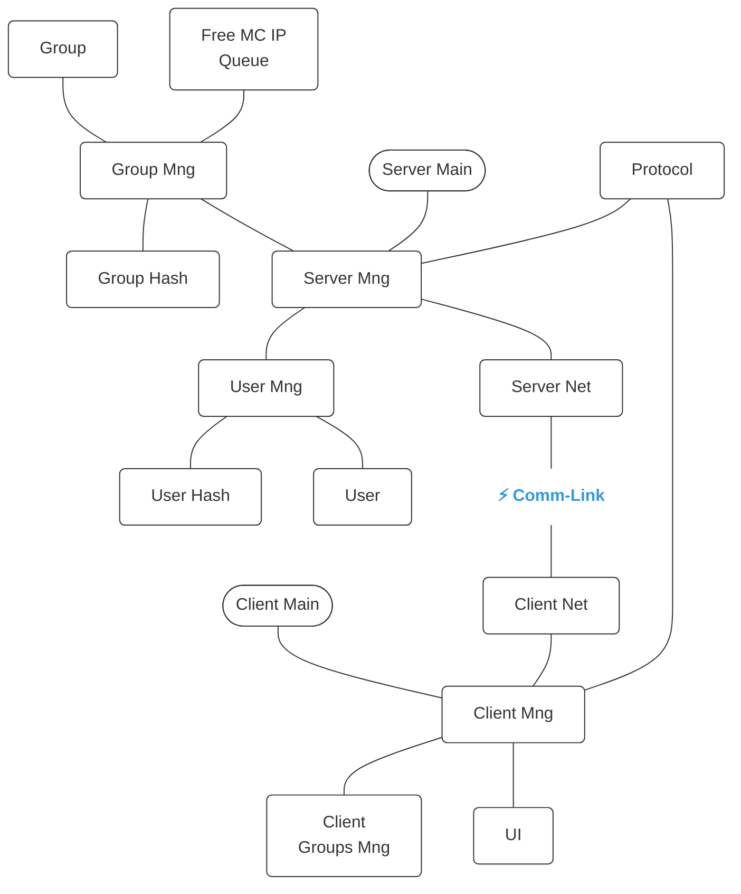

# CLAUDE.md

This file provides guidance to Claude Code (claude.ai/code) when working with code in this repository.

# LAN Chat Application — Full Technical Description

## 1. Project Overview

A real-time LAN chat application written in **C** that enables group messaging between registered participants. The system is split into a **server** and a **client**, communicating over **TCP** for all management operations and **UDP multicast** for chat message delivery.

The application uses the pre-built data structures library (`libds.so`) located at `~/projectsLinux/DS/`. Available modules: BST, GenHeap, GenQueue, GenStack, GenVector, HashMap, LinkedList. Include the relevant headers and link against `libds.so` where needed — no need to rewrite any data structure code.

---

## 2. Architecture



---

## 3. Protocol — TLV (Tag-Length-Value)

Every message between client and server is encoded as one or more TLV units:

```
┌──────────────┬──────────────┬──────────────────────┐
│  Tag (1 byte)│ Length (2 B) │  Value (Length bytes) │
└──────────────┴──────────────┴──────────────────────┘
```

### 3.1 Tag Definitions

| Tag (hex) | Name              | Direction       | Value Contents                       |
| --------- | ----------------- | --------------- | ------------------------------------ |
| 0x01      | REGISTER_REQ      | Client → Server | username TLV + password TLV          |
| 0x02      | REGISTER_RESP     | Server → Client | status code                          |
| 0x03      | LOGIN_REQ         | Client → Server | username TLV + password TLV          |
| 0x04      | LOGIN_RESP        | Server → Client | status code                          |
| 0x05      | LOGOUT_REQ        | Client → Server | (empty)                              |
| 0x06      | LOGOUT_RESP       | Server → Client | status code                          |
| 0x07      | CREATE_GROUP_REQ  | Client → Server | group name TLV                       |
| 0x08      | CREATE_GROUP_RESP | Server → Client | status + multicast IP TLV + port TLV |
| 0x09      | JOIN_GROUP_REQ    | Client → Server | group name TLV                       |
| 0x0A      | JOIN_GROUP_RESP   | Server → Client | status + multicast IP TLV + port TLV |
| 0x0B      | LEAVE_GROUP_REQ   | Client → Server | group name TLV                       |
| 0x0C      | LEAVE_GROUP_RESP  | Server → Client | status code                          |

### 3.2 Data Field Tags (nested inside request/response values)

| Tag (hex) | Name       | Value                                   |
| --------- | ---------- | --------------------------------------- |
| 0x20      | USERNAME   | UTF-8 string                            |
| 0x21      | PASSWORD   | UTF-8 string                            |
| 0x22      | GROUP_NAME | UTF-8 string                            |
| 0x23      | MC_IP      | IPv4 string (e.g., "239.0.0.1")         |
| 0x24      | MC_PORT    | 2 bytes, network byte order             |
| 0x25      | STATUS     | 1 byte (0x00 = OK, 0x01+ = error codes) |
| 0x26      | ERROR_MSG  | UTF-8 string                            |

### 3.3 Status / Error Codes

| Code | Meaning                 |
| ---- | ----------------------- |
| 0x00 | SUCCESS                 |
| 0x01 | USERNAME_ALREADY_EXISTS |
| 0x02 | USERNAME_NOT_FOUND      |
| 0x03 | WRONG_PASSWORD          |
| 0x04 | ALREADY_LOGGED_IN       |
| 0x05 | GROUP_ALREADY_EXISTS    |
| 0x06 | GROUP_NOT_FOUND         |
| 0x07 | ALREADY_IN_GROUP        |
| 0x08 | NOT_IN_GROUP            |
| 0x09 | SERVER_ERROR            |

### 3.4 TCP Stream Parsing Strategy

Since TCP is a byte stream with no message boundaries, the receiver must:

1. Read bytes into a per-client buffer.
2. Check if a complete TLV is available (tag + length + enough value bytes).
3. If complete — parse and pass up to Mng layer. Remove consumed bytes from buffer.
4. If incomplete — wait for next `select()` read cycle to get more data.

This is why each node in the doubly linked list needs its own receive buffer.

---

## 4. Module Descriptions

### 4.1 Server Main

Entry point for the server application.

- Calls Server Mng CREATE to initialize everything.
- Calls Server Mng RUN to enter the main loop.
- On shutdown signal, calls Server Mng DESTROY to clean up.

### 4.2 Server Net

TCP server using `select()` for I/O multiplexing. No threads.

**Data Structure:** Doubly linked list where each node represents a connected client.

**Node contents:**

- `int socket_fd` — the client's TCP socket
- `int client_id` — unique identifier assigned on connection
- `char recv_buffer[]` — partial TLV data waiting to be completed
- `int buffer_len` — how many bytes are currently in the buffer
- `struct ClientNode *prev, *next` — list pointers

**API:**
| Function | Description |
|------------|-------------|
| `CREATE` | Create listening TCP socket, bind to port, listen, initialize empty client list |
| `RUN` | Main event loop: build `fd_set` from listening socket + all client sockets, call `select()`. Handle: new connection (accept, add node to list), incoming data (read into buffer, pass complete TLVs upward via callback), client disconnect (remove node, close socket, notify Mng) |
| `SENDMSG` | Takes a client ID (or broadcast flag) and a message buffer. Walks the list to find the target, calls `send()` on their socket |
| `STOPRUN` | Sets a running flag to 0, causing RUN's loop to exit cleanly |
| `DESTROY` | Iterates through entire list, closes every socket, frees every node, closes listening socket |

**Key design decisions:**

- O(1) insertion: new clients added to head of list.
- O(1) removal: on disconnect, the node pointer is available directly.
- `select()` requires rebuilding `fd_set` each iteration and tracking `max_fd`.

### 4.3 Server Mng

Central server logic. Receives parsed TLV messages from Server Net and dispatches to the appropriate handler.

**Responsibilities:**

- **Session mapping:** Maps each connected client ID (from Server Net) to a logged-in user. Maintains a mapping structure (e.g., array or hash) from client_id → user record pointer.
- **Request routing:** Parses the TLV tag from incoming messages and dispatches to the correct handler function (register, login, logout, create group, join group, leave group).
- **Response building:** Constructs TLV response messages and sends them back through Server Net's SENDMSG.
- **Disconnect handling:** When Server Net reports a client disconnect, Server Mng removes that user from all groups (decrementing counters, auto-closing empty groups) and marks the user as inactive.
- **Lifecycle:** On CREATE — initializes User Mng, Group Mng, Free MC IP Queue, and Server Net. On DESTROY — shuts down all sub-modules.

**Handler details:**

| Handler      | Logic                                                                                                                                                                                                                                                     |
| ------------ | --------------------------------------------------------------------------------------------------------------------------------------------------------------------------------------------------------------------------------------------------------- |
| REGISTER     | Extract username + password from TLV. Check User Hash for uniqueness. If unique — create user via User Mng, respond SUCCESS. If exists — respond USERNAME_ALREADY_EXISTS.                                                                                 |
| LOGIN        | Extract username + password. Look up in User Hash. Verify password. If valid — mark active, map client_id to user, respond SUCCESS. If not — respond with appropriate error.                                                                              |
| LOGOUT       | Look up user by client_id. Remove from all groups via Group Mng (decrement counters, auto-close empties). Mark user inactive. Clear session mapping. Respond SUCCESS.                                                                                     |
| CREATE_GROUP | Extract group name. Check Group Hash for uniqueness. If unique — allocate multicast IP from Free MC IP Queue, create group via Group Mng, auto-join the creator (increment counter), respond with MC IP + port. If exists — respond GROUP_ALREADY_EXISTS. |
| JOIN_GROUP   | Extract group name. Look up in Group Hash. If found — increment member counter, respond with MC IP + port. If not — respond GROUP_NOT_FOUND.                                                                                                              |
| LEAVE_GROUP  | Extract group name. Look up in Group Hash. Decrement member counter. If counter reaches 0 — destroy group, return MC IP to Free MC IP Queue. Respond SUCCESS.                                                                                             |

### 4.4 User Mng

Manages user records.

**User record structure:**

- `char username[]`
- `char password[]` (or hashed password)
- `int is_active` — whether currently logged in
- `int client_id` — the client_id from Server Net when active, -1 when inactive
- List of group names the user belongs to (for cleanup on logout/disconnect)

**Operations:**

- Create user (called by register handler)
- Find user by username (via User Hash)
- Validate password
- Set active / inactive
- Get list of groups for a user

### 4.5 User Hash

Hash table (using `HashMap` from `libds.so`) mapping username (string) → User record pointer. Provides O(1) average lookup for login and registration uniqueness checks.

### 4.6 Group Mng

Manages group records.

**Group record structure:**

- `char group_name[]`
- `char multicast_ip[]` — assigned from Free MC IP Queue
- `uint16_t multicast_port`
- `int member_count` — number of connected clients
- List of member user pointers or client IDs

**Operations:**

- Create group (allocate MC IP, initialize counter to 0)
- Add member (increment counter)
- Remove member (decrement counter)
- Destroy group (return MC IP to queue, free memory)
- Find group by name (via Group Hash)

### 4.7 Group Hash

Hash table mapping group name (string) → Group record pointer. Provides O(1) average lookup for group operations.

### 4.8 Free MC IP Queue

A queue of available multicast IP addresses (range 239.0.0.1 — 239.0.0.254 or similar). Initialized at server startup with all addresses.

**Operations:**

- Dequeue — returns the next available multicast IP (called when creating a group)
- Enqueue — returns a multicast IP to the pool (called when a group is destroyed)

This ensures each active group has a unique multicast address.

### 4.9 Protocol

Shared between server and client. Provides functions to:

- **Encode:** Build a TLV byte buffer from tag + value data.
- **Decode:** Parse a byte buffer into tag, length, and value.
- **Nest:** Build compound messages (e.g., a REGISTER_REQ containing a USERNAME TLV and a PASSWORD TLV).
- **Status helpers:** Create success/error response TLVs.

This module is compiled into both the server and client binaries. It is the contract that keeps both sides compatible.

### 4.10 Client Main

Entry point for the client application.

- Calls Client Mng CREATE to initialize everything.
- Calls Client Mng RUN to enter the main interaction loop.
- On exit, calls Client Mng DESTROY to clean up.

### 4.11 Client Net

TCP client that maintains a single connection to the server.

**API:**
| Function | Description |
|------------|-------------|
| `CREATE` | Creates a TCP socket, connects to the server's IP and port |
| `SENDMSG` | Takes a TLV message buffer and sends it to the server |
| (receive) | Reads from the socket (can be called from Client Mng's loop), buffers partial TLVs, returns complete messages |

The client only has one connection, so there is no need for `select()` or a linked list here. However, it does need a receive buffer for partial TLV handling, same as the server side.

### 4.12 Client Mng

Central client logic. Drives the UI flow and translates user actions into protocol messages.

**Responsibilities:**

**Screen 1 — Pre-Login:**

- Display menu: 1. Register, 2. Login, 3. Exit
- On Register: collect username + password → build REGISTER_REQ TLV → send via Client Net → wait for response → display success or error
- On Login: collect username + password → build LOGIN_REQ TLV → send → wait → on success transition to Screen 2, on error show message
- On Exit: send nothing, just close the TCP connection via Client Net, free memory, exit

**Screen 2 — Post-Login:**

- Display menu: 1. Create Group, 2. Join Group, 3. Leave Group, 4. Logout
- On Create Group: collect group name → build CREATE_GROUP_REQ TLV → send → wait → on success, store group info locally (via Client Groups Mng), launch chat windows. On error, show message.
- On Join Group: collect group name → build JOIN_GROUP_REQ TLV → send → wait → on success, store group info, launch chat windows. On error, show message.
- On Leave Group: collect group name → build LEAVE_GROUP_REQ TLV → send → wait → on success, kill chat window processes, remove from local list. On error, show message.
- On Logout: build LOGOUT_REQ TLV → send → wait for OK → kill all chat window processes, clear all local group data, transition back to Screen 1.

**Chat window launching (on join/create success):**

1. Receive multicast IP + port from server response.
2. Launch the **Multicast Receiver App** in a new `gnome-terminal` window via `system()`, passing MC IP and port as arguments.
3. Launch the **Multicast Sender App** in another `gnome-terminal` window via `system()`, passing MC IP, port, and the username as arguments.
4. Both child apps find their own PID with `getpid()` and send it back to Client Mng via a **POSIX message queue** (or System V message queue).
5. Client Mng receives the PIDs and stores them in Client Groups Mng alongside the group info.

**Chat window closing (on leave/logout):**

1. Look up the group's stored PIDs in Client Groups Mng.
2. Call `kill(pid, SIGTERM)` on both the sender and receiver processes.
3. Remove the group entry from Client Groups Mng.

### 4.13 UI

The terminal-based user interface module. Handles:

- Printing menus to the terminal
- Reading user input (menu choices, username, password, group name)
- Displaying success/error messages

This is a thin layer — it does no protocol logic. Client Mng calls UI functions to display prompts and get input.

### 4.14 Client Groups Mng

Local data structure (e.g., a linked list or small hash table) that tracks every group the client is currently a member of.

**Entry structure:**

- `char group_name[]`
- `char multicast_ip[]`
- `uint16_t multicast_port`
- `pid_t sender_pid` — PID of the multicast sender terminal process
- `pid_t receiver_pid` — PID of the multicast receiver terminal process

**Operations:**

- Add group entry (on successful join/create)
- Remove group entry (on leave)
- Find group by name
- Iterate all (for logout — kill all windows)
- Destroy all (cleanup)

### 4.15 Multicast Sender App

A **standalone small C program** (separate executable).

**Behavior:**

1. Receives multicast IP, port, and username as command-line arguments.
2. Calls `getpid()` and sends its PID back to Client Mng via message queue.
3. Enters a loop: reads a line from stdin, prepends the username, sends the formatted message to the multicast address via UDP `sendto()`.
4. On receiving SIGTERM — exits cleanly.

**Socket setup:**

- Create a UDP socket.
- Set `IP_MULTICAST_TTL` to 1 (LAN only).
- Target address is the multicast IP + port.

### 4.16 Multicast Receiver App

A **standalone small C program** (separate executable).

**Behavior:**

1. Receives multicast IP and port as command-line arguments.
2. Calls `getpid()` and sends its PID back to Client Mng via message queue.
3. Creates a UDP socket, binds to the multicast port.
4. Joins the multicast group using `IP_ADD_MEMBERSHIP` with the multicast IP.
5. Enters a loop: calls `recvfrom()`, prints the received message to stdout.
6. On receiving SIGTERM — leaves the multicast group (`IP_DROP_MEMBERSHIP`), closes socket, exits.

---

## 5. Data Flow Examples

### 5.1 Registration Flow

```
User types "1" (Register) in UI
        │
        ▼
Client Mng collects username + password from UI
        │
        ▼
Client Mng builds REGISTER_REQ TLV:
  [0x01][len][ [0x20][len][username] [0x21][len][password] ]
        │
        ▼
Client Net sends TLV bytes over TCP
        │
        ▼
Server Net receives bytes in select() loop
Server Net completes TLV in client's buffer
Server Net passes complete message to Server Mng via callback
        │
        ▼
Server Mng parses tag 0x01 → REGISTER handler
  → Extracts username (tag 0x20) and password (tag 0x21)
  → Looks up username in User Hash
  → If not found: creates user via User Mng, responds [0x02][len][ [0x25][1][0x00] ]
  → If found: responds [0x02][len][ [0x25][1][0x01] ]
        │
        ▼
Server Net sends response bytes via SENDMSG
        │
        ▼
Client Net receives, Client Mng parses response
        │
        ▼
UI displays "Registration successful" or "Username already exists"
```

### 5.2 Join Group Flow

```
User types "2" (Join Group) + group name in UI
        │
        ▼
Client Mng builds JOIN_GROUP_REQ TLV:
  [0x09][len][ [0x22][len][group_name] ]
        │
        ▼
Client Net → TCP → Server Net → Server Mng
        │
        ▼
Server Mng parses tag 0x09 → JOIN handler
  → Looks up group in Group Hash
  → If found: increments member_count, responds with MC IP + port:
    [0x0A][len][ [0x25][1][0x00] [0x23][len][mc_ip] [0x24][2][port] ]
  → If not found: responds [0x0A][len][ [0x25][1][0x06] ]
        │
        ▼
Response travels back to Client Mng
        │
        ▼
Client Mng on success:
  → Stores group in Client Groups Mng
  → system("gnome-terminal -- ./mc_receiver 239.0.0.5 5000")
  → system("gnome-terminal -- ./mc_sender 239.0.0.5 5000 username")
  → Receives PIDs from message queue
  → Stores PIDs in Client Groups Mng entry
        │
        ▼
Two new terminal windows open:
  [Receiver window] — waiting for multicast messages, printing them
  [Sender window]   — waiting for user input, sending to multicast
```

### 5.3 Chat Message Flow (Multicast, no server involved)

```
User types a message in the Sender window
        │
        ▼
Multicast Sender App prepends username: "alice: hello everyone"
        │
        ▼
sendto() → UDP multicast to 239.0.0.5:5000
        │
        ▼
All Multicast Receiver Apps that joined 239.0.0.5 receive the packet
        │
        ▼
Each Receiver App prints: "alice: hello everyone"
```

Note: The server is NOT involved in chat message delivery. The server only manages groups and provides the multicast address. Actual messaging is peer-to-peer via UDP multicast on the LAN.

### 5.4 Leave Group Flow

```
User types "3" (Leave Group) + group name
        │
        ▼
Client Mng builds LEAVE_GROUP_REQ → sends to server
        │
        ▼
Server Mng:
  → Decrements member_count for the group
  → If member_count == 0:
      → Destroys the group record
      → Returns the multicast IP to Free MC IP Queue
  → Responds SUCCESS
        │
        ▼
Client Mng on success:
  → Looks up group in Client Groups Mng
  → kill(sender_pid, SIGTERM)
  → kill(receiver_pid, SIGTERM)
  → Removes group entry from Client Groups Mng
  → Chat windows close
```

### 5.5 Logout Flow

```
User types "4" (Logout)
        │
        ▼
Client Mng builds LOGOUT_REQ → sends to server
        │
        ▼
Server Mng:
  → Finds user by client_id
  → Iterates all groups the user is in
  → For each group: removes user, decrements counter, auto-closes if empty
  → Marks user inactive
  → Responds SUCCESS
        │
        ▼
Client Mng on success:
  → Iterates all entries in Client Groups Mng
  → Kills all sender + receiver PIDs
  → Clears Client Groups Mng
  → Transitions UI back to Screen 1
```

---

## 6. Development Phases

### Phase 0 — Shared Foundation (Raz + Ezra together)

**Goal:** Establish the shared contracts before any coding.

- **0.1** Write `protocol.h` — define all TLV tag constants, status codes, and encode/decode function signatures.
- **0.2** Agree on build system — Makefile, folder structure (`server/`, `client/`, `common/`), compiler flags (`-Wall -Wextra -g`), linking against `libds.so` from `~/projectsLinux/DS/`.
- **0.3** Set up shared Git repository.

**Deliverables:** `protocol.h`, `protocol.c`, Makefile, repo structure.

> **Note:** Data structures (LinkedList, HashMap, GenQueue, etc.) are already built and available as `libds.so` in `~/projectsLinux/DS/`. Just `#include` the relevant header and link with `-lds`.

---

### Phase 1 — Communication Layer

**Goal:** TCP communication working between server and client.

**Raz (Server):**

- Implement Server Net: CREATE, RUN, SENDMSG, STOPRUN, DESTROY.
- Implement the doubly linked list for client tracking (each node = one connected client with socket, buffer, ID).
- `select()` loop: handle new connections, incoming data, disconnections.
- Write a standalone test: server accepts multiple clients and echoes messages back.

**Ezra (Client):**

- Implement Client Net: CREATE, SENDMSG, receive logic.
- Single TCP socket connection to server.
- Receive buffer for partial TLV reassembly.
- Write a standalone test: client connects, sends a message, prints the server's response.

**Joint Integration Test:** Client connects to server, sends a TLV message, server parses and echoes it back, client prints it. Test with 2-3 simultaneous clients.

---

### Phase 2 — User Management

**Goal:** Register, login, and logout working end-to-end.

**Raz (Server):**

- Implement User Mng — user record creation, lookup, password validation, active/inactive state.
- Implement User Hash — hash table mapping username → user record.
- Implement Server Mng handlers for: REGISTER, LOGIN, LOGOUT.
- Session mapping: client_id → user record.

**Ezra (Client):**

- Implement UI Screen 1 — terminal menu: register / login / exit.
- Implement Client Mng logic for Screen 1 — build TLV messages for register/login/logout, parse responses, display results, handle screen transitions.

**Joint Integration Test:** Client registers a new user → logs in → logs out → attempts login with wrong password (error) → registers duplicate username (error). All pass.

---

### Phase 3 — Group Management

**Goal:** Create, join, leave groups. Auto-close empty groups.

**Raz (Server):**

- Implement Group Mng — group record creation, member count tracking, destruction.
- Implement Group Hash — hash table mapping group name → group record.
- Implement Free MC IP Queue — initialize with multicast IP pool, dequeue on create, enqueue on destroy.
- Implement Server Mng handlers for: CREATE_GROUP, JOIN_GROUP, LEAVE_GROUP.
- Implement disconnect cleanup: when Server Net reports a client disconnect, remove user from all groups.

**Ezra (Client):**

- Implement Client Groups Mng — local list of joined groups with name, MC IP, port, PIDs.
- Implement UI Screen 2 — terminal menu: create group / join group / leave group / logout.
- Implement Client Mng logic for Screen 2 — build TLV messages, parse responses, manage screen transitions.
- (Window launching comes in Phase 4.)

**Joint Integration Test:** Create a group → join it from a second client → both see the multicast info → one leaves → the last one leaves → group auto-closes on server. Create a group with a duplicate name (error).

---

### Phase 4 — Multicast Chat

**Goal:** Actual chat messaging working between clients.

**Ezra (Client):**

- Implement `mc_sender.c` — standalone program: reads stdin, sends via UDP to multicast address.
- Implement `mc_receiver.c` — standalone program: joins multicast group, prints received messages.
- Both programs send their PID back to Client Mng via POSIX/SysV message queue on startup.
- Implement window launching in Client Mng: `system()` + `gnome-terminal` to open sender/receiver terminals.
- Implement window closing: `kill()` on stored PIDs.

**Raz (Server):**

- Support testing: run server while Ezra tests multicast.
- Help debug any multicast network issues on LAN.

**Joint Integration Test:** Two clients join the same group. Client A types a message in sender window → Client B sees it in receiver window, and vice versa. Client A leaves → windows close → Client B still works. Client B leaves → group auto-closes.

---

### Phase 5 — Integration & Polish (Together)

**Goal:** Robust, leak-free application.

- **5.1** Full end-to-end test: 3+ clients, multiple groups, concurrent operations.
- **5.2** Edge cases:
  - Client crashes mid-session (server detects disconnect, cleans up).
  - Client tries to join a group they're already in.
  - Client tries to leave a group they're not in.
  - Duplicate login attempt while already logged in.
  - Server runs out of multicast IPs (queue empty).
- **5.3** Memory leak check with `valgrind` — every allocation must be freed on all paths (normal exit, logout, disconnect, error).
- **5.4** (Bonus) Encryption — implement a simple cipher (e.g., XOR with a shared key) in the Protocol layer. Applied to TLV values before sending, decrypted after receiving. Both sides use the same key.
- **5.5** (Bonus) Improved UI — colored terminal output (ANSI codes), formatted message display, better menu layout.

---

## 7. File Structure

```
~/projectsLinux/DS/                # Pre-built data structures library (DO NOT MODIFY)
├── BST/
├── GenHeap/
├── GenQueue/
├── GenStack/
├── GenVector/
├── HashMap/
├── LinkedList/
├── libds.so
└── makefile

project/
├── common/
│   ├── protocol.h          # TLV tag definitions, encode/decode signatures
│   └── protocol.c          # TLV encode/decode implementation
│
├── server/
│   ├── server_main.c       # Entry point
│   ├── server_net.h        # Server Net API: CREATE, RUN, SENDMSG, STOPRUN, DESTROY
│   ├── server_net.c
│   ├── server_mng.h        # Server Mng API
│   ├── server_mng.c
│   ├── user_mng.h          # User management
│   ├── user_mng.c
│   ├── group_mng.h         # Group management
│   ├── group_mng.c
│   └── Makefile
│
├── client/
│   ├── client_main.c       # Entry point
│   ├── client_net.h        # Client Net API: CREATE, SENDMSG
│   ├── client_net.c
│   ├── client_mng.h        # Client Mng API
│   ├── client_mng.c
│   ├── ui.h                # UI functions
│   ├── ui.c
│   ├── client_groups_mng.h # Local group tracking
│   ├── client_groups_mng.c
│   ├── mc_sender.c         # Standalone multicast sender app
│   ├── mc_receiver.c       # Standalone multicast receiver app
│   └── Makefile
│
└── Makefile                # Top-level: builds server + client + mc apps
```

**Linking against the DS library:**

```makefile
DS_PATH = ~/projectsLinux/DS
CFLAGS = -Wall -Wextra -g -I$(DS_PATH)/LinkedList -I$(DS_PATH)/HashMap -I$(DS_PATH)/GenQueue
LDFLAGS = -L$(DS_PATH) -lds -Wl,-rpath,$(DS_PATH)
```

---

## 8. Build & Run

```bash
# Build everything
make all

# Run server (on one machine)
./server/chat_server 9000

# Run client (on another machine, or same machine for testing)
./client/chat_client 192.168.1.100 9000

# The mc_sender and mc_receiver are launched automatically by the client
# when joining a group — no need to run them manually.
```

---

## 9. Key Technical Notes

- **All management operations are TCP.** Registration, login, logout, group create/join/leave — all go through the TCP channel managed by Server Net / Client Net.
- **All chat messages are UDP multicast.** The server never sees chat content. It only provides the multicast address. Clients talk directly to each other via multicast.
- **`select()` is mandatory** for the server's event loop. No threads, no `poll()`, no `epoll()`.
- **Doubly linked list is mandatory** for tracking connected clients in Server Net.
- **The pre-built `libds.so` library must be used** — `#include` the relevant headers (LinkedList, HashMap, GenQueue, etc.) from `~/projectsLinux/DS/` and link against `libds.so`. Do not rewrite data structures.
- **Chat windows are separate processes** launched via `gnome-terminal` + `system()`. PIDs are communicated back via message queues. Windows are closed via `kill()`.
